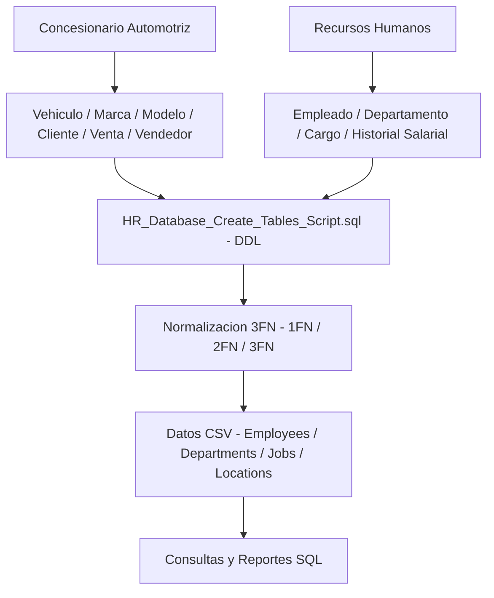

# Modelo Relacional y Constraints — Car Dealership & Human Resources DB

> Diseño e implementación propios de bases de datos relacionales para dos dominios de negocio: concesionario automotriz y recursos humanos.

## Descripción

---

Proyecto desarrollado por **Alejandro De Mendoza** que aplica el modelo relacional sobre dos dominios de negocio reales: un **concesionario de automóviles** y un sistema de **recursos humanos**. Se implementa el diseño completo desde el DER hasta el DDL en SQL, con normalización a 3FN, restricciones de integridad referencial y optimización de consultas para reportes de negocio.

## Dominios modelados

### Concesionario automotriz
- Entidades: Vehículo, Marca, Modelo, Cliente, Venta, Vendedor
- Relaciones: Cliente compra Vehículo a través de Venta, Vendedor gestiona Venta

### Recursos Humanos
- Entidades: Empleado, Departamento, Cargo, Historial Salarial, Ubicación

## Arquitectura

## Normalización aplicada

| Forma Normal | Condición satisfecha |
|---|---|
| 1FN | Atributos atómicos, clave primaria definida |
| 2FN | Dependencias totales sobre la clave primaria |
| 3FN | Sin dependencias transitivas entre atributos no clave |

## Contenido del repositorio

| Archivo | Descripción |
|---|---|
| `HR_Database_Create_Tables_Script.sql` | DDL completo del esquema HR |
| `*.csv` | Datos de prueba: Employees, Departments, Jobs, Locations |
| `Activity.docx` | Enunciado y desarrollo de las actividades |

## Contexto académico

**Asignatura:** Bases de Datos · **Institución:** Ingeniería Informática
**Autor:** Alejandro De Mendoza — Ingeniero Informático · Especialista en Ingeniería de Software · Máster en Arquitectura de Software

---

## Autor

**Alejandro De Mendoza**  
Ingeniero Informático · Especialista en IA · Especialista en Ingeniería de Software · Máster en Arquitectura de Software

